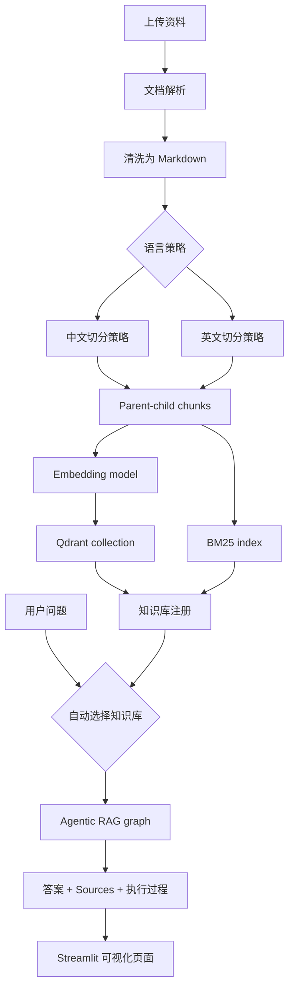
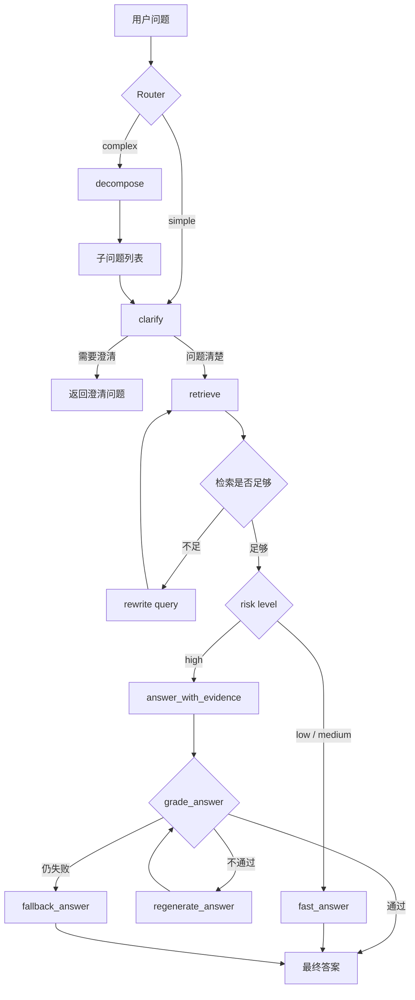

# Agentic RAG Visualized

## Demo


一个可视化 Agentic RAG 示例项目。项目保留完整的 Agentic RAG 流程，并用 Streamlit 展示路由、澄清、检索、改写、风险判断、证据回答、答案校验和多问题分解过程。

## 功能

- Simple / Complex 问题路由
- 中文/英文知识库切换
- 中英文不同切分策略
- 多文档上传并构建知识库
- Qdrant 向量检索 + BM25 + RRF 混合检索
- Parent-child chunking
- 检索失败后的 rewrite retry
- 风险感知回答路径
- 高风险问题的 evidence / grounding 流程
- 可折叠的模型执行过程
- 来源文档和证据片段展示

## 系统流程



## Agentic RAG 执行流程



## 项目结构

```text
.
├── app.py
├── docker-compose.yml
├── requirements.txt
├── src/
│   ├── agentic_rag.py
│   ├── graph.py
│   ├── router.py
│   ├── clarification.py
│   ├── evidence.py
│   ├── hybrid_retriever.py
│   ├── knowledge_base.py
│   └── document_parsing/
├── webui/
├── tests/
└── data/
    └── parsed_docs/
```

## 运行前提

建议使用已有的 conda 环境运行。项目依赖 Qdrant、本地 embedding 模型和大模型 API。

1. 安装依赖：

```powershell
pip install -r requirements.full-reference.txt
pip install -r requirements.txt
```

如果你已经有完整的 LangChain / LangGraph / Qdrant 环境，只需要补装：

```powershell
pip install -r requirements.txt
```

2. 配置环境变量：

```powershell
Copy-Item src\.env.example src\.env
```

然后在 `src/.env` 中填写：

```text
QWEN_API_KEY=your_api_key
```

3. 启动 Qdrant：

```powershell
docker compose up -d
```

4. 构建默认示例知识库：

```powershell
python -m src.qdrant_store
```

5. 启动页面：

```powershell
streamlit run app.py
```

默认访问地址：

```text
http://localhost:8501
```

## 知识库

项目支持在页面中上传资料并构建知识库。上传构建出的本地知识库会写入：

```text
data/knowledge_bases/
```

该目录已被 `.gitignore` 排除，避免把个人资料、缓存向量库配置上传到 GitHub。

## 中英文策略

- 中文问题优先使用中文知识库。
- 英文问题优先使用英文知识库。
- 不在查询时临时切换 embedding 模型。不同 embedding 模型必须对应不同知识库或重建后的知识库。
- 中文问题的分解、改写、澄清、回答和证据流程会保持中文。
- 英文问题保持英文。

## 不会上传的内容

`.gitignore` 已排除：

- `.env`
- LLM SQLite cache
- 本地上传资料和知识库
- Qdrant / Chroma 本地数据
- 日志文件
- Python 编译缓存

## 测试

```powershell
pytest tests -q
```

## 说明

这个项目是教学和实验用途的 Agentic RAG 可视化实现。生产环境中建议继续补充：

- 更严格的权限控制
- 用户上传文件的安全扫描
- 更完整的文档解析异常处理
- 可配置 reranker
- 持久化用户会话
- 更细的评测集和线上监控
