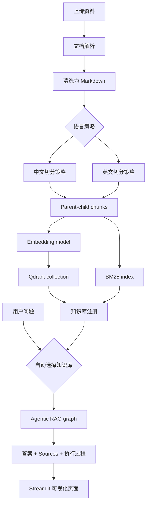
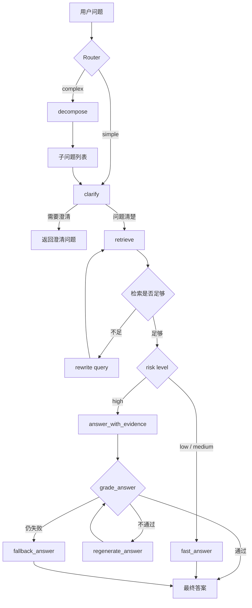

# Agentic RAG Visualized

## Demo


一个可视化 Agentic RAG 示例项目。项目保留完整的 Agentic RAG 流程，并用 Streamlit 展示路由、澄清、检索、改写、风险判断、证据回答、答案校验和多问题分解过程。

## 功能

- Simple / Complex 问题路由
- 中文/英文知识库切换
- 中英文不同切分策略
- 多文档上传并构建知识库
- Qdrant 向量检索 + BM25 + RRF 混合检索
- Parent-child chunking
- 检索失败后的 rewrite retry
- 风险感知回答路径
- 高风险问题的 evidence / grounding 流程
- 可折叠的模型执行过程
- 来源文档和证据片段展示

## 系统流程



## Agentic RAG 执行流程



## 项目结构

```text
.
├── app.py                         # Streamlit 应用入口，加载主页面
├── docker-compose.yml             # 本地 Qdrant 向量数据库启动配置
├── requirements.txt               # 项目运行所需的核心 Python 依赖
├── requirements.full-reference.txt # 完整参考依赖，便于复现实验环境
├── docs/
│   └── assets/                    # README 演示图片和视频资源
│       ├── rag-demo.gif           # README 中直接展示的演示动图
│       └── rag.mp4                # 原始演示视频文件
├── src/
│   ├── agentic_rag.py             # Agentic RAG 总入口，连接 router 与 simple/complex 流程
│   ├── graph.py                   # LangGraph 单问题 RAG 图，包含澄清、检索、改写、评分和回答节点
│   ├── streaming_agentic_rag.py   # 流式输出封装，支持 simple、证据链和 complex 汇总流式展示
│   ├── router.py                  # 问题路由器，判断 simple / complex 并给出路由原因
│   ├── clarification.py           # 澄清判断，识别问题是否过于模糊
│   ├── evidence.py                # 证据抽取、证据回答、快速回答和流式回答 prompt
│   ├── graders.py                 # 文档相关性评分和答案 grounding 校验
│   ├── hybrid_retriever.py        # 混合检索入口，整合 Qdrant、BM25 和 RRF
│   ├── qdrant_store.py            # Qdrant 向量库构建、连接和 retriever 创建
│   ├── bm25_store.py              # BM25 稀疏检索索引构建和查询
│   ├── knowledge_base.py          # 知识库配置模型、注册表和默认知识库读取
│   ├── knowledge_base_builder.py  # 上传资料后构建新知识库
│   ├── kb_routing.py              # 根据问题语言自动选择中文或英文知识库
│   ├── parent_child_splitter.py   # 父子分块策略，用小块检索、大块回答
│   ├── llm.py                     # 大模型客户端配置
│   ├── llm_cache.py               # LLM 调用缓存和流式缓存读取
│   ├── query_rewritter.py         # 检索失败或低相关时的问题改写
│   ├── config.py                  # 路径、模型、检索数量和重试次数等全局配置
│   ├── agents/
│   │   ├── decomposer.py          # complex 问题分解为多个独立子问题
│   │   ├── muti_agent_rag.py      # 多子问题并发执行和汇总流程
│   │   ├── aggregator.py          # 子问题答案汇总，支持流式聚合
│   │   └── retrieval_agent.py     # 检索型 Agent 实验实现
│   └── document_parsing/
│       ├── ingest_pipeline.py     # 上传文档解析、清洗和入库流水线
│       ├── parser_registry.py     # 不同文档类型解析器注册中心
│       ├── parser_service.py      # 统一文档解析服务入口
│       ├── markdown_parser.py     # Markdown 文档解析
│       ├── pymupdf_parser.py      # PDF 文档解析
│       ├── docling_parser.py      # Office / 富文档解析适配
│       └── cleaner.py             # 文档文本清洗和规范化
├── webui/
│   ├── agentic_chat_page.py       # 主聊天页面，展示答案、Sources 和模型执行过程
│   ├── knowledge_base_panel.py    # 侧边栏知识库选择、上传和构建界面
│   └── workflow_visualizer.py     # Mermaid 流程图和节点状态可视化
├── tests/                         # 单元测试和关键流程回归测试
└── data/
    └── parsed_docs/               # 默认示例文档解析后的 Markdown 数据
```

## 运行前提

建议使用已有的 conda 环境运行。项目依赖 Qdrant、本地 embedding 模型和大模型 API。

1. 安装依赖：

```powershell
pip install -r requirements.full-reference.txt
pip install -r requirements.txt
```

如果你已经有完整的 LangChain / LangGraph / Qdrant 环境，只需要补装：

```powershell
pip install -r requirements.txt
```

2. 配置环境变量：

```powershell
Copy-Item src\.env.example src\.env
```

然后在 `src/.env` 中填写：

```text
QWEN_API_KEY=your_api_key
```

3. 启动 Qdrant：

```powershell
docker compose up -d
```

4. 构建默认示例知识库：

```powershell
python -m src.qdrant_store
```

5. 启动页面：

```powershell
streamlit run app.py
```

默认访问地址：

```text
http://localhost:8501
```

## 知识库

项目支持在页面中上传资料并构建知识库。上传构建出的本地知识库会写入：

```text
data/knowledge_bases/
```

该目录已被 `.gitignore` 排除，避免把个人资料、缓存向量库配置上传到 GitHub。

## 中英文策略

- 中文问题优先使用中文知识库。
- 英文问题优先使用英文知识库。
- 不在查询时临时切换 embedding 模型。不同 embedding 模型必须对应不同知识库或重建后的知识库。
- 中文问题的分解、改写、澄清、回答和证据流程会保持中文。
- 英文问题保持英文。


## 测试

```powershell
pytest tests -q
```


